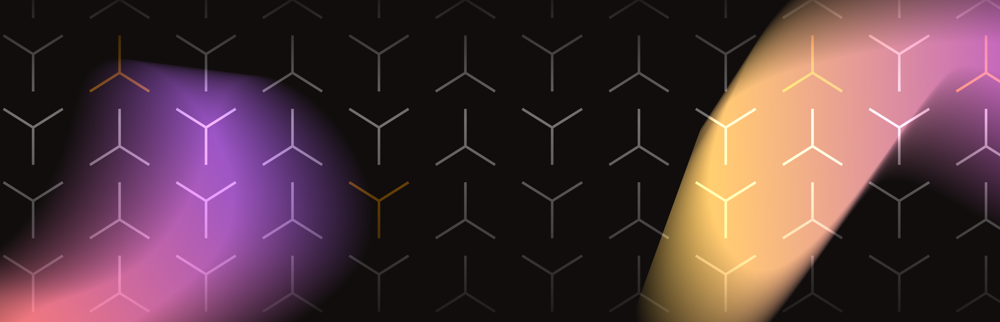

# What is Kaichi?

## Introduction to Kaichi

Kaichi is a **decentralized**, **uncensorable**, and **permissionless** **social marketplace** on a natively **scalable** blockchain, allowing **trading of social capital** and fair **sharing of revenues** between users and creators directly. \
\
Social media represents a vast industry with evident issues such as centralized power, inadequate creator monetization, censorship, and data privacy concerns. Web2 platforms retain the majority of revenues generated from user engagement and advertising, neglecting to adequately share these earnings with content creators.

Kaichi aims to address these challenges by <mark style="color:yellow;">**introducing the next-generation monetization and revenue-sharing models**</mark>, granting users ownership of content, implementing decentralized governance, ensuring transparency, and providing control over user data.&#x20;

**Imagine** the combination of Twitter, Binance, Patreon or Onlyfans **with fair revenue sharing,**  **decentralized** and **censorship-resistant:** you now have all of this in one place on [**kaichi.xyz**](https://kaichi.xyz)&#x20;

Kaichi comes with both mobile apps (on <mark style="color:red;">iOS</mark> and <mark style="color:red;">Android</mark>) and a [website](https://kaichi.xyz) (desktop and mobile). Kaichi is running on the <mark style="color:yellow;">**Solana**</mark> mainnet offering users a full-fledged, feature-rich social marketplace: from publishing any kind of content on the Solana blockchain directly or on IPFS, [minting their own user token](main-concepts/user-tokens-fees-and-revenue-sharing.md), creating [memecoins](social-media-industry-research/kaichi-value-proposition/tokenizing-social-capital-ico.md#c.-the-memecoiner-dream), [monetizing](social-media-industry-research/kaichi-value-proposition/multiform-monetiztion.md) their content, and [sharing](social-media-industry-research/kaichi-value-proposition/revenue-sharing.md) access and revenues with their community, to following and investing in other communities or individuals, etc.

## Mission and Vision

We introduce a novel approach to social media interactions.&#x20;

Our primary goal is to create a <mark style="color:yellow;">**more open, inclusive social marketplace with a fair revenue-sharing model**</mark> providing users with different instruments, features, and ways of monetization. Scaling solutions, such as those offered by Solana natively are essential for accommodating growing user bases and sustaining network efficiency.

Central to our ethos is <mark style="color:yellow;">**a**</mark> <mark style="color:yellow;">**commitment to value creation for token holders**</mark> and to **distributing such value** at every layer to the community.&#x20;

For us, **crypto** is not just technology - **it's a mindset**. Our approach is full-on web3, we are done with web2 or web2.5 solutions. We want to raise global economic prosperity, allowing anyone to unlock growth through the transformative potential of cryptocurrencies. Kaichi allows users to monetize their content, their value-add, irrespective of their talents, by tokenizing their social capital and sharing their success with their audience.&#x20;

Our approach is rooted in the conviction that **tokens underpinning protocols with robust fundamentals will lead the next cycle of outperformance,** outpacing even established benchmarks like Bitcoin.&#x20;

We firmly believe that tokens backed by protocols demonstrating a strong product-market fit, guided by strong and visionary management teams, and showcasing a clear path to sustainable unit economics will excel.&#x20;

Now, <mark style="color:yellow;">**you**</mark> can participate in the **growth of your favorite influencer** or project and get financially rewarded.&#x20;
