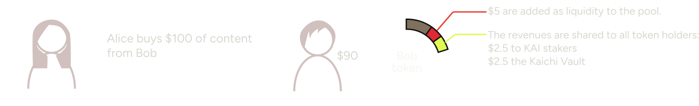
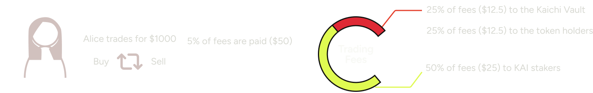
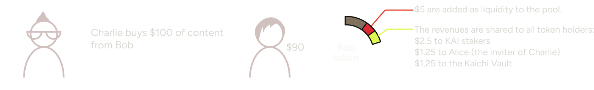
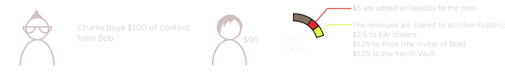
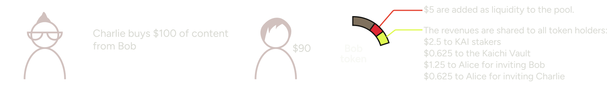

---
layout:
  title:
    visible: true
  description:
    visible: false
  tableOfContents:
    visible: true
  outline:
    visible: true
  pagination:
    visible: true
---

# Referral Program

Kaichi allows you to earn revenues if you invite someone that spends money (by purchasing content such as subscriptions or pay-per-view) or by trading any user token on Kaichi.\
Kaichi also allows you to earn revenues if you invite someone that mint a token, and get popular (if people purchase his content, or trade his token).

You'll find below the exact mechanics for each scenario.

## SCENARIO 1: BASE CASE WITHOUT REFERRAL

### Token Minting Split

Bob creates a new creator token: he keeps 90% of the supply (80% locked, 10% unlocked), 5% is sold in the pool, and the remaining 5% are used by Kaichi for the revenue sharing.

<figure><figcaption></figcaption></figure>

### Content Purchase

Alice purchases content from Bob (such as a Subscription or Pay-per-view). 
All Bob token holders receive a share of the revenue proportional to their holdings.

<figure><figcaption></figcaption></figure>

### Trading

When Alice buys or sells any creator token on Kaichi, 5% of trading fees are collected and redistributed.

<figure><figcaption></figcaption></figure>

## SCENARIO 2: ALICE INVITES CHARLIE WHO SPENDS MONEY

### Token Minting Split - Unchanged

Bob creates a new creator token: he keeps 90% of the supply (80% locked, 10% unlocked), 5% is sold in the pool, and the remaining 5% are used by Kaichi for the revenue sharing.

<figure><figcaption></figcaption></figure>

### Content Purchase: when Charlie spends money, Alice earns some revenues

Now if Charlie purchases content from Bob, then Alice will earn a portion of the revenue as well (because Alice has invited Charlie). The $1.25 that Alice earned are claimable as cash back in USDC to her wallet.

<figure><figcaption></figcaption></figure>

### Trading: when Charlie trades, Alice earns some revenues

When Charlie buys or sells any creator token on Kaichi, 5% of trading fees are collected and redistributed. 
Alice earns some of these fees too given she has invited Charlie.

<figure><figcaption></figcaption></figure>

## SCENARIO 3: ALICE INVITES BOB WHO MINTS A TOKEN

### Token Minting Split - Alice will receives half the profit share of the Kaichi Vault

Bob creates a new creator token: he keeps 90% of the supply (80% locked, 10% unlocked), 5% is sold in the pool, and the remaining 5% are shared to KAI stakers, to the Kaichi Vault, and also to Alice (although she can’t access them, only the revenue stream allocated to these tokens will go to Alice).

<figure><figcaption></figcaption></figure>

### Content Purchase: when someone spends money on Bob, Alice earns some revenues

Now if Charlie purchases content from Bob, then Alice will earn a portion of the revenue as well (because Alice has invited Bob, so if Bob is a successful creator, Alice will earn a lot of referral fees). The $1.25 that Alice earned are claimable as cash back in USDC to her wallet.

<figure><figcaption></figcaption></figure>

### Trading: when someone trades Bob’s token, Alice earns some revenues

When Charlie (or anyone) buys or sells Bob’s token on Kaichi, 5% of trading fees are collected and redistributed. 
Alice earns some of these fees too given she has invited Bob and get a share of his token’s trading revenue.

<figure><figcaption></figcaption></figure>

## SCENARIO 4: ALICE INVITES BOB AND CHARLIE

### Token Minting Split - Alice will receives half the profit share of the Kaichi Vault

Bob creates a new creator token: he keeps 90% of the supply (80% locked, 10% unlocked), 5% is sold in the pool, and the remaining 5% are shared to KAI stakers, to the Kaichi Vault, and also to Alice (although she can’t access them, the revenue stream allocated to these tokens will go to Alice).

<figure><figcaption></figcaption></figure>

### Content Purchase: when someone spends money on Bob or when Charlie spends money, Alice earns some revenues

If anyone purchases content from Bob, then Alice will earn a portion of the revenue as well (because Alice has invited Bob, so if Bob is a successful creator, Alice will earn a lot of referral fees).


And if Charlies spends money on anyone, then Alice will earn a portion of the revenue as well (because Alice has invited Charlies, so if Charlie is a high spender, Alice will earn a lot of referral fees).&#x20;

The $1.25 that Alice earned are claimable as cash back in USDC to her wallet.

<figure><figcaption></figcaption></figure>

### Trading: when someone trades Bob’s token, or when Charlie makes a trade, Alice earns some revenues

When anyone buys or sells Bob’s token on Kaichi, 5% of trading fees are collected and redistributed. 


Alice earns some of these fees too given she has invited Bob and get a share of his token’s trading revenue.


Plus when Charlie makes a trade, a portion of the trading fees are also distributed to Alice because she invited Charlie.


<figure><figcaption></figcaption></figure>


**Disclaimer:** The terms and conditions of this referral program are subject to change at any time without prior notice.


