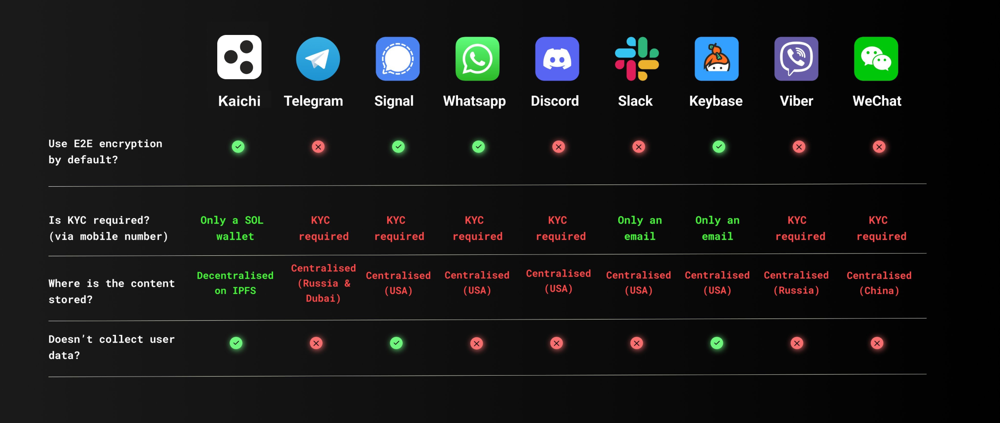

---
layout:
  title:
    visible: true
  description:
    visible: false
  tableOfContents:
    visible: true
  outline:
    visible: true
  pagination:
    visible: true
---

# Private Messages (DM)

Users have the ability to send each-other direct messages (DM), these 1-to-1 DM are fully encrypted & decentralised, to the point where Kaichi is one of the most private way to discuss with with someone.&#x20;

This technical feature is explained in more details [under the P2P Direct Messaging article](../deepdive/p2p-direct-messaging.md).

<figure><figcaption>
Comparing Kaichi's DM with other messaging apps
</figcaption></figure>

Group chats on the other end are less decentralised for the time being. However this will change in the future.

Group chats members are restricted only to the holders of the user token.&#x20;

For example if you hold the tokens BOBBY, ALICE and PUSSYCAT, you'll have access to 3 group chats: one group chat with the token holders of the BOBBY token (and with Bobby himself), one with the holders of the ALICE token, and one with the holders of the PUSSYCAT token.\
